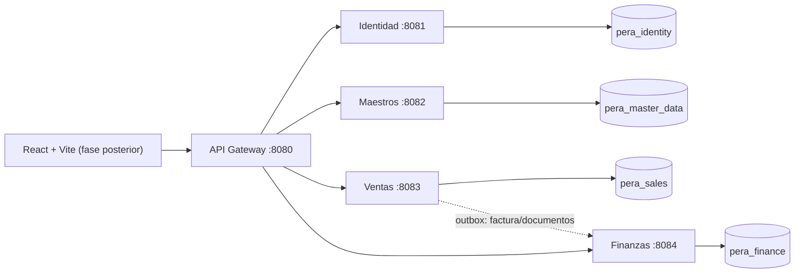

# Arquitectura

## Vista de servicios

## Responsabilidades

| Servicio | Propiedad funcional | Datos principales |
|---|---|---|
| API Gateway | Entrada, CORS, JWT y rutas | Ninguno |
| Identidad | Login, empresas, usuarios, roles y permisos | empresas, usuarios, pertenencias, roles, permisos |
| Maestros | Terceros y catálogo | clientes, proveedores, contactos, artículos, tarifas, obras |
| Ventas | Ciclo documental comercial | documentos, líneas, secuencias y outbox |
| Finanzas | Cobro y tesorería | formas de pago, vencimientos, recibos, remesas, riesgo y caja |

## Decisión sobre granularidad

La especificación inicial proponía un monolito modular y el encargo solicita microservicios. Se adopta una solución intermedia deliberada: cinco despliegues gruesos y cohesionados, no un servicio por entidad. El dominio interno de cada despliegue sigue organizado por módulos para que sea posible fusionar o extraer piezas sin reescribir el modelo.

## Multiempresa

El login selecciona una pertenencia usuario–empresa y emite `company_id` en el JWT. Maestros, ventas y finanzas derivan el tenant exclusivamente de ese claim y filtran todos los agregados por empresa. No se confía en un `company_id` enviado en el cuerpo HTTP.

La primera versión aplica aislamiento en repositorios y restricciones únicas compuestas. Antes de producción se añadirá una prueba de aislamiento por endpoint y se evaluará PostgreSQL Row-Level Security como segunda barrera.

## Consistencia entre servicios

- Dentro de un servicio: transacciones ACID PostgreSQL.
- Entre servicios: IDs externos y snapshots; nunca claves foráneas cruzando bases.
- Ventas registra eventos en una tabla outbox dentro de la misma transacción que el documento.
- El publicador de outbox y el consumidor financiero se implementarán cuando se elija broker. Hasta entonces, la generación de vencimientos queda disponible como comando REST idempotente por documento.
- No se implementan transacciones distribuidas.

## Seguridad

El entorno local usa JWT HMAC compartido para mantener el arranque sencillo. Los servicios convierten los claims `permissions` y `roles` en autoridades y separan permisos de lectura y escritura por dominio. Producción deberá usar claves asimétricas rotables o un proveedor OIDC, gestión externa de secretos, TLS y auditoría de acciones sensibles.

## Despliegue local y futuro

Compose usa una sola instancia PostgreSQL para ahorrar recursos, pero crea una base por servicio. En producción pueden ser instancias separadas sin cambiar el código. Docker DNS resuelve servicios localmente; no se añade Eureka porque el orquestador ya proporciona descubrimiento y el MVP no necesita otra pieza operativa.
